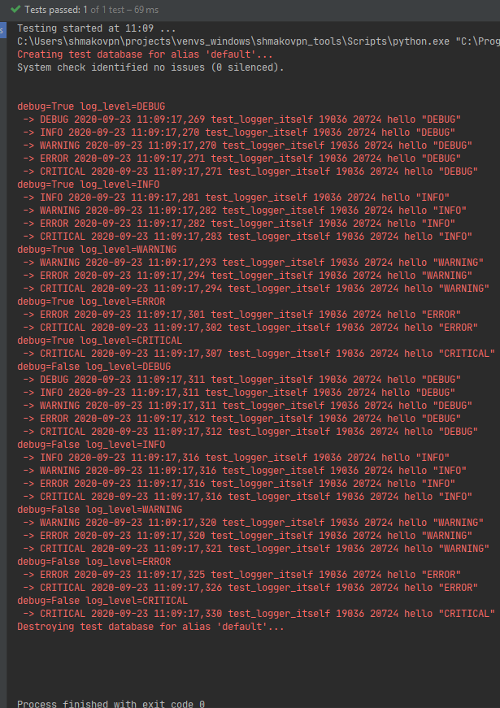

Django
======

Installation
------------

.. code-block:: shell-session

 # dnf install -y python-django-bash-completion

.. code-block:: shell-session

 $ workon shmakovpn
 $ pip install django

.. warning:: If you want to use **SQLite** with **Django** under **Centos 7**, so it doesn't work out of the box. Please, read DjangoCentos7SQLite_ to understand how to solve this.

.. note:: Centos 8 doesn't have problems with **SQLite**.

.. _DjangoCentos7SQLite: https://stackoverflow.com/questions/55485858/using-sqlite3-with-django-2-2-and-python-3-6-7-on-centos7/56594609#56594609 to understand how to solve this.

Starting a new **Django** project
---------------------------------

Create a new directory for **Django** project

.. code-block:: shell-session

 $ mkdir ~/projects/shmakovpn_tools/shmakovpn/django_examples

Start a new **Django** project

.. code-block:: shell-session

 $ django-admin startproject django_examples ~/projects/shmakovpn_tools/shmakovpn/django_examples

Initialize database

.. code-block:: shell-session

 $ python ~/projects/shmakovpn_tools/shmakovpn/django_examples/manage.py migrate
 Operations to perform:
 ...
 ...
   Appying sessions.0001_initial... OK

A simple application with logging
---------------------------------

Imagine two persons.
A *developer* and an *Administrator*.
First of them writes code in a sandbox,
or other words, in an isolated testing environment.
He knows about code anything.
But he doesn't work in real life,
there are many factors able to make the application works something wrong:
hardware, network, software updates, stupid users,
natural disasters and etc.
The *Administrator* lives that life.
He is a person, who knows nothing about code.
Maybe, he even hates code. And he isn't one of them who fixes bugs in it.

The application has to include a log system.
If something wrong has happened,
an *Administrator* increases the logging level then sends logs to developers.

Let's take a look at a simple Django application
that includes a multi-level log system.

Start a new **Django** application

.. code-block:: shell-session

 $ mkdir ~/projects/shmakovpn_tools/shmakovpn/django_examples/logging_example
 $ django-admin startapp logging_example ~/projects/shmakovpn_tools/shmakovpn/django_examples/logging_example

Edit **INSTALLED_APPS** section in the **Django** project *settings.py* file

.. code-block:: shell-session

 $ vim ~/projets/shmakovpn_tools/shmakovpn/django_examples/django_examples/settings.py

Add **logging_example** to **INSTALLED_APPS**

.. code-block:: python

 INSTALLED_APPS = [
     ...
     ...
     'logging_example',
 ]

Edit the *__init__.py* file of the created application

.. code-block:: shell-session

 $ vim ~/projects/shmakovpn_tools/shmakovpn/django_examples/logging_example/__init__.py

.. literalinclude:: ../../../shmakovpn/django_examples/logging_example/__init__.py
  :language: python

.. note:: A *tests.py* file is created inside a **Django** application by default. But as the application grows, this file becomes too large. So, we will not use it, we are going to split tests to several packages and files.

.. figure:: /_static/django_examples/logging_example/python-tests-structure.svg
 :alt: python tests structure

 **Django** (**python**) tests structure

Create *tests* python package inside the application folder

.. code-block:: shell-session

 $ mkdir ~/projects/shmakovpn_tools/shmakovpn/django_examples/logging_example/tests
 $ touch ~/projects/shmakovpn_tools/shmakovpn/django_examples/logging_example/tests/__init__.py

Create *logger_itself* python package inside the application folder

.. code-block:: shell-session

 $ mkdir ~/projects/shmakovpn_tools/shmakovpn/django_examples/logging_example/tests/logger_itself
 $ touch ~/projects/shmakovpn_tools/shmakovpn/django_examples/logging_example/tests/logger_itself/__init__.py

Delete default *tests.py*

.. code-block:: shell-session

 $ rm ~/projects/shmakovpn_tools/shmakovpn/django_examples/logging_example/tests.py

Create a test

.. code-block:: shell-session

 $ vim ~/projects/shmakovpn_tools/shmakovpn/django_examples/logging_example/tests/logger_itself/test_logger_itself.py

.. code-block:: python

 from unittest import TestCase

 class TestLoggerItself(TestCase):
     def test_logger_itself(self) -> None:
         print('hello from test')

Run test

.. code-block:: shell-session

 $ python ~/projects/shmakovpn_tools/shmakovpn/django_examples/manage.py test logging_example
 System check identified no issues (0 silenced).
 hello from test
 .
 ----------------
 Ran 1 test in 0.000s

 OK

Install **unittest_dataprovider**

.. code-block:: shell-session

 $ pip install unittest-dataprovider

We will test logger in two cases: DEBUG_MODE=True and DEBUG_MODE=False.
Each case should be performed for all standard levels of logging: debug,
info, warning, error, and critical.
To realize this, we can write 5 test functions,
but this approach violates the DRY (don't repeat yourself) principle.
The **dataprovider** decorator can make code clear and simple.

Also, the **dataprovider** needs data.
The easiest way to generate the data is **itertools.product**.

We will use **override_settings** context manager
to change the project configuration inside the test.

It is not enough to **override_settings**.
Because logging is configured before **override_settings** take effect.
Thus, it is need to call **configure_logging** to change logging settings in fact.

.. warning:: Don't forget to return the original logging settings back.

To catch writings in stderr we have to patch **sys.stderr** using **MagicMock**.
But to stay writing to stderr itself, the patched object has to be wrapped as **sys.stderr**.

.. literalinclude:: ../../../shmakovpn/django_examples/logging_example/tests/logger_itself/test_logger_itself.py
 :language: python

