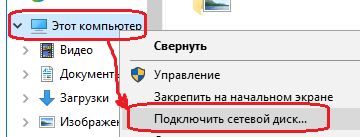
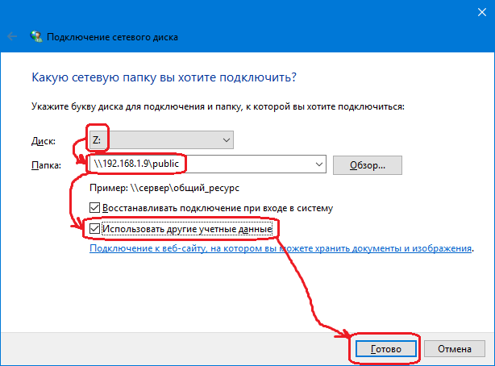
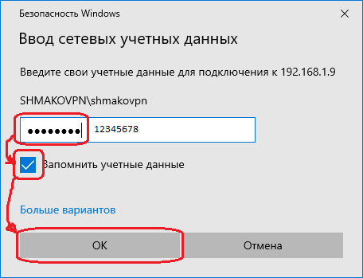
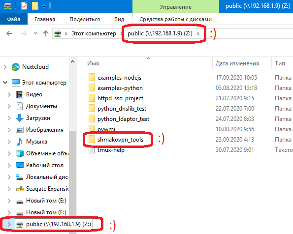

Working with the project hosted on a remote server
==================================================

.. warning:: Someone gives the advice to use **SFTP Drive**. It is a very slow program.

When I work with documentation,
I write it directly in console using **vim**.
After a file was changed, **inotifywait** runs *sphinx build* automatically.
Built documentation is shared using **Nginx** under **Docker**.
Please, read this:
:ref:`Sphinx/View your documentation on another host <remote_sphinx>`.

Now we are going to use **Samba** under **Docker**.

.. figure:: ../images/remote_ide/ide_to_server.svg
 :alt: An IDE interaction with a server 

I suppose that you are already installed **Docker**.
If not, please read this:
:ref:`Install docker <install_docker>`

Get **uid** and **gid**.

.. code-block:: shell-session

 $ id
 uid=1000(shmakovpn) gid=1000(shmakovpn) ...

Run the docker container.

.. code-block:: shell-session

 $ docker run \
    -it --rm \
    -p 139:139 \
    -p 445:445 \
    -p 137:137/udp \
    -p 138:138/udp \
    -e USERID=1000 \
    -e GROUPID=1000 \
    -v /home/shmakovpn/projects:/mount \
    -d dperson/samba \
    -p -n -r -S -w SHMAKOVPN \
    -u "shmakovpn;12345678" \
    -s "public;/mount;yes;no;no;shmakovpn"
 0c345071b5bace3d0e43092552db5362afea5fef55d13e323072fb34159beaa3
 
Mount **samba** share to a PC with an IDE.

Run an IDE, then open a project on the drive **Z:**.

Samba AD integration (Centos 7)
-------------------------------

Join your **Centos** server to an Active Directory Domain.
Please, read :ref:`this <centos_ad_integration>`.

Configure time synchronization.

.. code-block:: shell-session

 $ sudo vim /etc/chrony.conf

.. code-block:: bash

 server dc.shmakovpn.ru iburst  # Add your domain controllers here
 # server 0.centos.pool.ntp.org iburst
 # server 1.centos.pool.ntp.org iburst
 # server 2.centos.pool.ntp.org iburst
 # server 3.centos.pool.ntp.org iburst

.. code-block:: shell-session

 $ sudo systemctl restart chronyd

Verify hostname resolution

Samba will try to register the hostname in AD DNS zone.
Thus, the **net** utility must be able to resolve the hostname of the server using DNS or */etc/hosts* file.

To check DNS resolution

.. code-block:: shell-session

 $ nslookup $(hostname)

 Server:         192.168.1.2
 Address:        192.168.1.2#53

 Name:   c7.shmakovpn.ru
 Address: 192.168.1.8

If the hostname of your server cannot be resolved using DNS, add the record shown below to */etc/hosts*.

.. code-block:: shell-session

 $ sudo vim /etc/hosts

.. code-block:: bash

 192.168.1.8    c7.shmakovpn.ru c7

.. note:: Because the hostname of my server was resolved successfully, I don't need to add the record to */etc/hosts*.

Install packages

.. code-block:: shell-session

 $ sudo yum install -y samba

Looking for the **samba** config file

.. code-block:: shell-session

 $ smbd -b | grep CONFIGFILE
     CONFIGFILE: /etc/samba/smb.conf

Edit the config file of **samba**.

.. code-block:: shell-session

 $ sudo vim /etc/samba/smb.conf

.. note:: We will not install **winbind** because earlier the server was joined to the domain using **realmd**. Please, don't worry with **winbind** keywords in the config file.

.. code-block:: ini

 [global]
     workgroup = SHMAKOVPN
     security = ADS
     realm = SHMAKOVPN.RU
     winbind refresh tickets = yes
     # logging
     log file = /var/log/samba/log.%m
     log level = 0 vfs:2 auth:2 winbind:0 passdb:0 sam:0
     max log size = 500000
     # acl
     vfs objects = acl_xattr
     inherit owner = yes
     inherit acls = yes
     inherit permissions = yes
     map acl inherit = yes
     store dos attributes = yes
     locking = no
     # we will use etended attributes, need to disable mapping DOS attributes to UNIX attributes
     map archive = no
     map system = no
     map hidden = no
     map readonly = no
     # useful for debugging
     winbind enum users = yes
     winbind enum groups = yes

     # disable printing
     load printers = no
     printing = bsd
     printcap name = /dev/null
     disable spoolss = yes

     # idmap config for BUILTIN accounts
     idmap config * : backend = tdb
     idmap config * : range = 3000-7999

     # idmap mapping
     idmap config SHMAKOVPN:backend = ad
     idmap config SHMAKOVPN:range = 10000-999999

 [www]
     comment = Userspy www repository
     path = /var/www
     public = no
     writable = yes
     guest ok = no
     create mask = 0755
     directory mask = 0755

     # audit
     vfs objects = full_audit acl_xattr
     full_audit:prefix = %S|%I|%m|%u
     full_audit:failure = connect disconnect opendir mkdir rmdir closedir open close read pread write pwrite sendfile rename unlink chmod fchmod chown fchown chdir ftruncate lock symlink readlink link mknod realpath
     full_audit:success = connect disconnect opendir mkdir rmdir closedir open close read pread write pwrite sendfile rename unlink chmod fchmod chown fchown chdir ftruncate lock symlink readlink link mknod realpath
     full_audit:facility = local5
     full_audit:priority = debug

     # access for users and groups
     valid users = @"home-users@shmakovpn.ru"
     write list = @"home-users@shmakovpn.ru"
     admin users = @"home-users@shmakovpn.ru"

Open **explorer** on your **Windows** PC and go *\\c7.shmakovpn.ru\www*.
Access using IP-address will not work, because we using **Kerberos** authentication.

You have to use the hostname used when the server was joined to the domain.
You have to use the hostname used when the server was joined to the domain.
This hostname saved in */etc/krb5.keytab* in *host* record.

.. code-block:: shell-session

 $ sudo ktutil
 ktutil:  rkt /etc/krb5.keytab
 ktutil:  list
 slot KVNO Principal
 ---- ---- ---------------------------------------------------------------------
    1    1 restrictedkrbhost/c7.shmakovpn.ru@SHMAKOVPN.RU
    2    1        restrictedkrbhost/C7@SHMAKOVPN.RU
    3    1 restrictedkrbhost/c7.shmakovpn.ru@SHMAKOVPN.RU
    4    1        restrictedkrbhost/C7@SHMAKOVPN.RU
    5    1 restrictedkrbhost/c7.shmakovpn.ru@SHMAKOVPN.RU
    6    1        restrictedkrbhost/C7@SHMAKOVPN.RU
    7    1 restrictedkrbhost/c7.shmakovpn.ru@SHMAKOVPN.RU
    8    1        restrictedkrbhost/C7@SHMAKOVPN.RU
    9    1 restrictedkrbhost/c7.shmakovpn.ru@SHMAKOVPN.RU
   10    1        restrictedkrbhost/C7@SHMAKOVPN.RU
   11    1        host/c7.shmakovpn.ru@SHMAKOVPN.RU
   12    1                     host/C7@SHMAKOVPN.RU
   13    1        host/c7.shmakovpn.ru@SHMAKOVPN.RU
   14    1                     host/C7@SHMAKOVPN.RU
   15    1        host/c7.shmakovpn.ru@SHMAKOVPN.RU
   16    1                     host/C7@SHMAKOVPN.RU
   17    1        host/c7.shmakovpn.ru@SHMAKOVPN.RU
   18    1                     host/C7@SHMAKOVPN.RU
   19    1        host/c7.shmakovpn.ru@SHMAKOVPN.RU
   20    1                     host/C7@SHMAKOVPN.RU
   21    1                         C7$@SHMAKOVPN.RU
   22    1                         C7$@SHMAKOVPN.RU
   23    1                         C7$@SHMAKOVPN.RU
   24    1                         C7$@SHMAKOVPN.RU
   25    1                         C7$@SHMAKOVPN.RU
 ktutil:  q

Configure the samba audit log

.. code-block:: shell-session

 $ sudo touch /etc/rsyslog.d/samba.conf
 $ sudo vim /etc/rsyslog.d/samba.conf

.. code-block:: bash

 $RepeatedMsgReduction on  # do not log repeated massages
 $SystemLogRateLimitInterval 1
 $SystemLogRateLimitBurst 1000
 $IMUxSockRateLimitBurst 1000
 $IMUxSockRateLimitInterval 1
 $IMUxSockRateLimitSeverity 5
 local5.debug /var/log/samba/log.audit

.. code-block:: shell-session

 $ sudo systemctl restart rsyslog

Configure **samba** logs rotation.

.. code-block:: shell-session

 $ sudo touch /etc/logrotate.d/samba
 $ sudo vim /etc/logrotate.d/samba

.. code-block:: bash

 /var/log/samba/log.audit {
     daily
     size 400M
     maxsize 500M
     missingok
     rotate 20
     postrotate
         /etc/init.d/rsyslog restart
     endscript
     compress
     compresscmd /usr/bin/bzip2
     uncompresscmd /usr/bin/bzip2
     compressext .bz2
     notifempty
 }

Configure **firewalld**.

.. code-block:: shell-session

 $ sudo firewall-cmd --zone=public --add-service=samba --permanent
 $ sudo firewall-cmd --reload

Configure **SELinux**.

 Take a look at the path to the samba share folder, it is the path to a web server content.

 .. code-block:: shell-session

  $ sudo ls -alZ /var/www
  drwxr-xr-x.  5 root root system_u:object_r:httpd_sys_content_t:s0       62 июн  8 23:16 .
  drwxr-xr-x. 23 root root system_u:object_r:var_t:s0                   4096 окт  2 13:47 ..
  drwxr-xr-x.  2 root root system_u:object_r:httpd_sys_script_exec_t:s0    6 июн  8 23:16 cgi-bin
  drwxr-xr-x.  2 root root system_u:object_r:httpd_sys_content_t:s0        6 июн  8 23:16 html
  ...

 The web server needs that the */var/www* folder and all of its content must have a right **SELinux** context.
 Something like **httpd_sys_content_t** and etc.
 But **Samba** has its own **SELinux** context,
 named **samba_share_t**, and a file or a folder can have only one context.
 To solve this conflict let's stay the webserver's contexts and allow **Samba** to read/write anywhere.

 .. code-block:: shell-session

  $ sudo setsebool -P samba_export_all_rw 1

Samba AD integration (Centos 8)
-------------------------------

Centos 8 AD integration process almost the same as Centos 7.

If samba daemon starting failed,
and there are *ERROR: failed to setup guest info* in */var/log/smbd.log*.
Please run

.. code-block:: shell-session

 $ sudo net -s /dev/null groupmap add sid=S-1-5-32-546 unixgroup=nobody type=builtin

In **Centos 8** **samba** requires **winbind**.
Install packages.

.. code-block:: shell-session

 $ sudo dnf install -y samba-winbind-clients

Join to domain (you are already joined using **realmd**, but it not the same).
Join once again using the **net** utility.

.. code-block:: shell-session

 $ sudo net ads join -U shmakovpn shmakovpn.ru
 Enter shmakovpn's password:
 Using short domain name -- SHMAKOVPN
 Joined 'C8-DNS-BIND' to dns domain 'shmakovpn.ru'
 DNS Update for c8-dns-bind.shmakovpn.ru failed: ERROR_DNS_UPDATE_FAILED
 DNS update failed: NT_STATUS_UNSUCCESSFUL
 $ sudo net ads testjoin
 Join is OK

Ignore *DNS update failed error*.

Start **winbind**.

.. code-block:: shell-session

 $ sudo systemctl enable winbind
 $ sudo systemctl start winbind

Edit samba config

.. code-block:: shell-session

 $ sudo vim /etc/samba/smb.conf

.. code-block:: bash

    # access for users and groups
    # valid users = @"home-users@shmakovpn.ru"
    # write list = @"home-users@shmakovpn.ru"
    # admin users = @"home-users@shmakovpn.ru"
    valid users = "@SHMAKOVPN\home-users"
    write list = "@SHMAKOVPN\home-users"
    admin users = "@SHMAKOVPN\home-users"

Restart samba

.. code-block:: shell-session

 $ sudo systemctl restart smb

Configure **SELinux**.

 In Centos 8 **dac_override** must be allowed for **Samba**. There is no direct way of how to do this.
 We need to create the **SELinux** module and install it.

 .. code-block:: shell-session

  $ sudo semodule -DB  # disable suppressing the AVC log
  $ sudo logrotate -v -f -l /var/log/audit/audit.log  # rotate AVC log
  $ # Connect to share and try to create a new file
  $ sudo ausearch -t avc -ts recent  # looking for AVC denied dac_override for smbd
  ...
  ----
  time->Sun Oct 11 13:07:12 2020
  type=AVC msg=audit(1602410832.702:720): avc:  denied  { dac_override } for  pid=260711 comm="smbd" capability=1  scontext=system_u:system_r:smbd_t:s0 tcontext=system_u:system_r:smbd_t:s0 tclass=capability permissive=0
  ----
  ...
  $ # generate the SELinux module
  $ echo "type=AVC msg=audit(1602410832.702:720): avc:  denied  { dac_override } for  pid=260711 comm="smbd" capability=1  scontext=system_u:system_r:smbd_t:s0 tcontext=system_u:system_r:smbd_t:s0 tclass=capability permissive=0" | audit2allow -M se_smbd_allow_dac_override_policyllow_dac_override_po
  $ sudo semodule -i se_smbd_allow_dac_override_policy.pp  # install created module
  $ sudo semodule -B  # enable suppressing the AVC log

